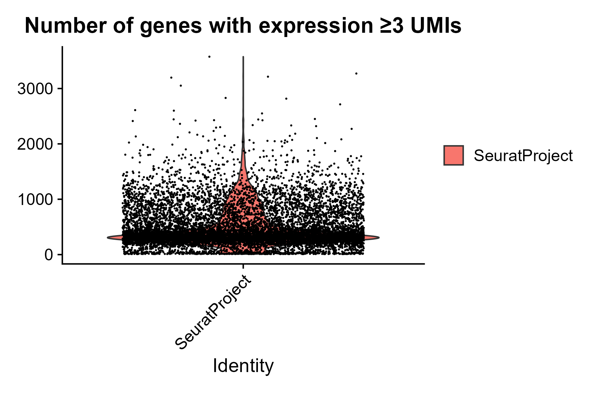
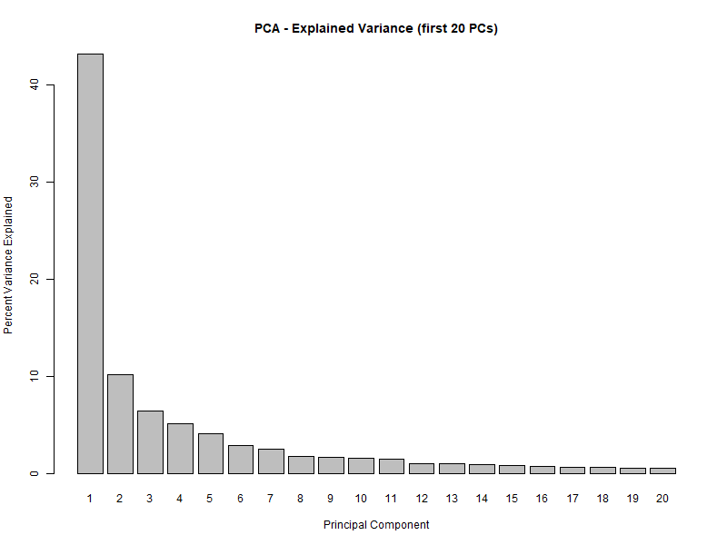
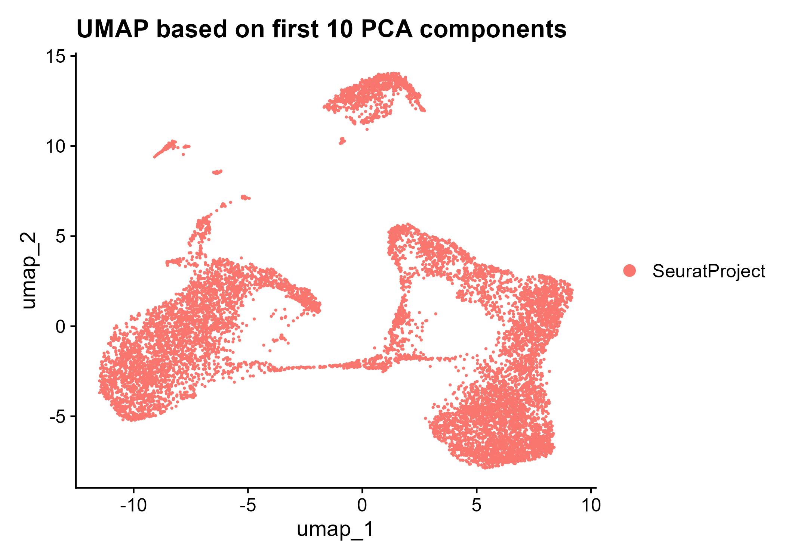
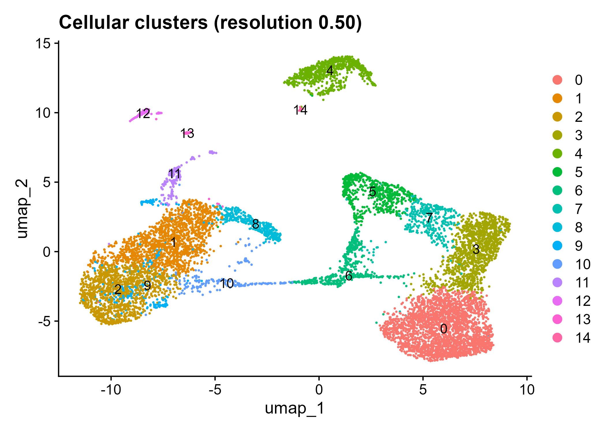
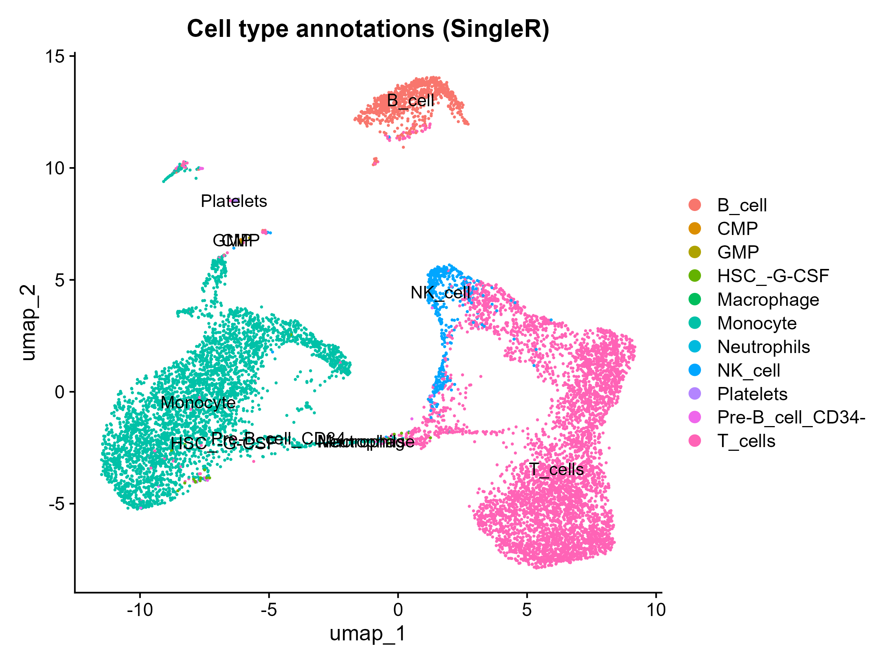

```{r setup, include=FALSE}
knitr::opts_chunk$set(echo = TRUE, message = FALSE, warning = FALSE)
library(Seurat)
library(programmingpackage)
library(SingleR)
library(celldex)
library(SummarizedExperiment)

```

## Step 0: Load data 
I loaded the raw single-cell dataset and filtered it to retain only protein-coding genes using a GTF annotation file.

```{r step0} 
data_dir <-"C:/Users/chiar/Documents/programming/filtered_feature_bc_matrix/filtered_feature_bc_matrix"
gtf_path <-"C:/Users/chiar/Documents/genomi/Homo_sapiens.GRCh38.111.gtf"

sc_data <- Read10X(data.dir = data_dir) 
seurat_obj <- CreateSeuratObject(counts = sc_data)

seurat_obj <- select_protein_coding_genes(seurat_obj, gtf_path)

```
## Step 1: Filter Protein-Coding Genes

Using the Ensembl GTF annotation file, I filtered the dataset to retain only protein-coding genes.This was done using the custom function `select_protein_coding_genes()`included in my package.The filtering ensures that downstream analysis focuses only on protein-coding gene expression profiles.

```{r step1-filter-pcg} 
seurat_obj <-select_protein_coding_genes(seurat_obj, gtf_path)

```
## Step 2: Gene Expression Summary

To assess the richness of gene expression per cell, I calculated the number of genes with expression ≥3 UMIs for each cell.This information was stored as a new metadata column (`n_genes_≥3UMI`)in the Seurat object.I visualized the distribution across cells using a violin plot.

```{r step2-expression-summary, echo=TRUE} 
seurat_obj <-summarize_expression_umi3_exact(seurat_obj)


```
## Step 3: Filtering of Ribosomal, Mitochondrial and Pseudogenes

In this step, I removed unwanted gene categories from the dataset:
- **Ribosomal genes** (`RPS`, `RPL`)
- **Mitochondrial genes** (`MT-`)
- **Ribosomal pseudogenes** (`RPS.*P`, `RPL.*P`)

The filtering ensures that low-complexity or confounding gene types are excluded from downstream analysis. The list of removed genes and a summary table were saved in two different files.

```{r step3-filtering, echo=TRUE} 
seurat_obj <-filter_unwanted_genes(seurat_obj)
removed_table <- read.table("removed_genes_summary.txt", header = TRUE, sep= "\t") 
knitr::kable(removed_table, caption = "Number of removed genes by category")

```
## Step 4: PCA

I performed dimensionality reduction using PCA to capture the major sources of variation in the dataset.The first 20 principal components (PCs) were evaluated in terms of the variance they explain.We visualized this using a barplot.

```{r step4-pca, echo=TRUE} 
result_pca <- run_pca_variance_plot(seurat_obj)
seurat_obj <- result_pca$seurat_obj

```{r show-pca, echo=FALSE}


```
## Step 5: UMAP Visualization

I applied UMAP for visualization of the dataset in a low-dimensional space.The embedding was computed using the first 10 principal components.The resulting 2D projection provides an intuitive representation of cell relationships.

```{r step5-umap, echo=TRUE}
result_umap <- run_umap_plot(seurat_obj, dims = 1:10)
seurat_obj <- result_umap$seurat_obj


```
## Step 6: Clustering
I performed clustering on the dataset to identify groups of transcriptionally similar cells.  
This was done using a shared nearest neighbor (SNN) graph approach applied to the PCA space (dimensions 1 to 10). I used a resolution of 0.5. The resulting clusters were visualized on the UMAP embedding.

```{r step6-clustering, echo=TRUE}
result_cluster <- run_clustering(seurat_obj, dims = 1:10, resolution = 0.5)
seurat_obj <- result_cluster$seurat_obj


```
## Step 7: Cell Type Annotation using SingleR

To assign a cell type to each cell, I used the `SingleR` algorithm in combination with the **Human Primary Cell Atlas** as reference.  
The predicted cell type labels were stored in the metadata and visualized on the UMAP embedding.  
I also created a contingency table showing the correspondence between clusters and predicted cell types.

```{r step7-singleR}
result_annot <- annotate_cells_singleR(seurat_obj)
seurat_obj <- result_annot$seurat_obj


```
## Step 8: Tissue Origin Inference
Based on the annotation results obtained using SingleR and the Human Primary Cell Atlas reference,  
I think that the dataset is enriched in hematopoietic and immune cell types. The most frequent annotations include:

- **T cells**
- **B cells**
- **Natural killer (NK) cells**
- **Monocytes**
- **Neutrophils**
- **Platelets**
- **CD34+ and CD34- hematopoietic stem cells**
This cellular composition is highly indicative of a **hematopoietic tissue**, with both differentiated immune populations and stem/progenitor compartments. The presence of hematopoietic stem cells, along with multipotent progenitors such as CMP (Common Myeloid Progenitors) and GMP (Granulocyte-Macrophage Progenitors), suggests a tissue with active blood formation. As result, I hypothesize that the tissue of origin is most likely **bone marrow**, which contains a diverse mix of immune cells and progenitors, consistent with the annotations and clustering observed in the UMAP.


